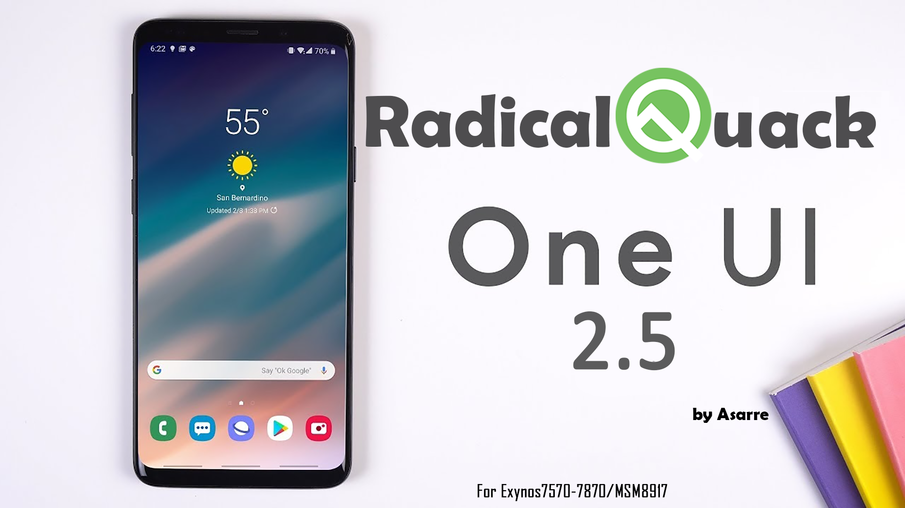

# Welcome to Radical Quack PORT For Exynos 7870 devices​

Some information you should know..
- This is a full OneUI 2.5 With Android 10 Ported from Galaxy Note 9
- Read the instructions and the F.A.Q Before installing the rom or posting a reply As there are critical information in there!.
- You are not allowed to use this base, aroma, or any parts of it for your own "ROM" if you want something just ask permission .
- Any sort of Kanging will be reported without hesitation.

# Compatibility:
- J730X: (Tested, stable)
- J600X: (Tested, stable)
- J530X: (Tested, stable)
- G610X: (Tested, stable)
- J701X: (Tested, stable)
- J710X: (Tested, stable)
- A600X: (Tested, stable)
 
 # Rom Features
- Android 10
- Radical OS features
- Full Samsung OneUI 2.5 Experience ported from Galaxy Note 9
- 1st June 2021 security patch
- Samsung Camera UI
- Screen Recorder
- AlwaysOn Display (J7 Only)
- Dual messenger
- Dynamic Lockscreen
- Focus mode
- Full Support for 3rd Party Camera app like footej (Only for devices with Samsung Pie Camera HAL)
- Note20 OMC
- OMC included for most countries
- Rootable with magisk stable and latest
- Samsung Music
- Screen Recorder
- Super optimized
- Ares V6 Kernel by @SPARTANICUS
- Adjusted Display UI
- and many more!

# Wallpaper-res pack
- Galaxy J(2017)
- Galaxy Note 9
# Emoji
- Samsung Emoji
- iOS Emoji

# Samsung Bloatware
- Allshare  
- Bixby Home
- Calculator
- Google chrome
- Samsung Calendar
- Samsung Cloud
- DictDiotekForSec
- Digital Wellbeing
- Photo/Video Editor and Viewers
- Samsung Email
- Facebook
- Samsung Files
- S Finder
- +1000 Fonts
- Galaxy Apps
- Samsung Gallery
- GameOptimizer
- LinkShare
- Samsung Music
- Sim Tool
- Camera Sticker
- Samsung TTS
- Samsung Video
- Samsung Weather

# Google Apps
- Google Search
- YouTube

# CSC Feat
- Network speed in statusbar
- Data icon in power menu
- Call recording
- LTE only network mode
- Data usage in quick panel
- LTE data icon(4G will be used if this is unchecked)
- Applock, Hide Album...

# Installation steps:

__1.Download the ROM__

__2.Ensure you have up-to-date TWRP (3.4.0.0) Or Ofox.__

__3.Copy the files you downloaded to PC or OTG or whatever__

__4.Reboot your phone to TWRP (Latest recovery for your devices)__

__5.Make sure OEM unlock is unlocked__

__6.Flash create-vendor if you haven't already you also can use @Astrako 's repartition script (You need 4GB system to use all bloatware)__

__7.Wipe data, dalvik, and cache__

__8.Flash ROM__

__9.Setup your ROM and Enjoy Quack!!__

# Download Link : [Click Here](https://drive.google.com/file/d/1LWqzON2DVkIwO0hveoVi30FDD4cNTbX5/view?usp=sharing)
